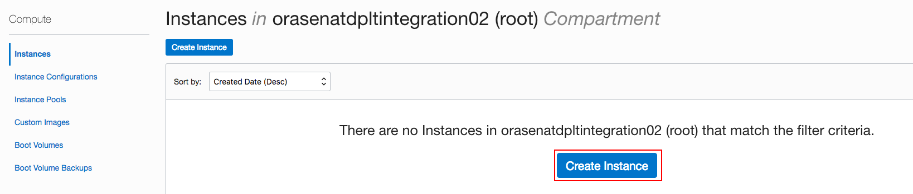

# Creating Gateway on OIC

## Introduction

This is the first of several labs that are part of the **Create API on Oracle Integration Cloud**. Oracle API Gateways are software-based appliances that can be installed wherever you want, that is, physical or virtual compute on premise or in the cloud. This workshop will walk you through the process of creating Gateway and deploying it to API on Oracle Integration Cloud. 

## High-level Steps

1.	Provision Linux VM on OCI
2.	Set Console Connections on the Linux instance
3.	Allow inbound connections to the Linux instance
4.	Install and configure logical API Gateway 
5.	Add additional roles to cloud.admin user
6.	Install and configure host (server) API Gateway

## Required Artifacts

For this lab you will need:

- Oracle Cloud Accounts [Cloud Trial Account - https://bit.ly/2yvpjSH](https://bit.ly/2yvpjSH)
- SSH Public and Private Key

## STEP 1: Provision Iaas VM
- Log in to the cloud account which you just created

- Click on thd **MENU** on the left top and click on **Compute**
  

- After you opened the **Compute** page, pick one **COMPARTMENT** on the left corner  
  
  
- Click on **Create an Instance**
  

- Enter the following values in the Create Instance dialog
(1)	**Name**: XX_OL610 (Replace XX with your initials)
(2)	**Image Operating System**: Oracle Linux 7.6 
  
(3)	**SSH Keys**: Choose SSH Key Files
(4)	Click on **Browse** and select the local public key (e.g. oci_instance.pub)
(5) Keep all other values to default and click on **Create Instance**. After several minutes, your new Oracle Linux instance will be running
  

  **NOTE** Your Oracle Linux is now ready for the Gateway installation. Click on the newly created instance and note down the primary information, such as Private and Public IP Address. 
  

## STEP 2: Create a Console Connection for Mac User 

 We will now create a Console Connection, which allows us to use an SSH connection to the instance host. 

- On the instance page, click on the instance you just created
  

- In the bottom left menu under **Resources**, click on **Console Connections** 
  
  
-Use the provided SSH key to setup the console connection
  

- When complete, the Console Connection will be in Active state

## STEP 3: Allow inbound connections to the Linux instance
- Run the following commands in the terminal:
    > iptables -I INPUT 1 -p tcp --dport 8011 -j ACCEPT
    > iptables -I INPUT 1 -p tcp --dport 9022 -j ACCEPT
- Go back to your **Compute**-> **Network**-> **Resource**-> **Ingress Rule**, add three Ingress Rules [Port Range are 22, 80, and 443]

## STEP 4: Setup API Gateway
 Now that we have provisioned an Oracle Linux environment, we are going to use it to continue installing an Oracle API Gateway and configure it to join our Autonomous API Platform instance. First let’s create the Logical Gateway configuration in our API Platform Management console. This is the space through which the physical API gateway will be in constant management and synchronization.

- Click on **MENU** on the left top, and choose **My Services Dashboard** under **Administration**
  
  
- Search the **Oracle Autonomous API Platform Cloud Service** and click on it
  

- Create an instance by clicking the **Create** located on the right corner
  
 
- Fill out all the information it needed and click on **Next**
  
  
- Confrim all the information and hit **Create**
  
 
- After the instance created, click on the **hamburger** shape button and choose **Access API Platform Service Instance**
  
  
  
- Click on the top left burger menu and select **Gateways**

- Click on **Create**

- Give it a good name and description. Then click **Create**

- Now your new Logical Gateway is creating, click on it after it's done

- On the left vertical menu, click on **Nodes** and then **Download Gateway Installer**

- While it finishes downloading, click on **Open Installation Wizard**, it will help us build the properties file required to install and configure our physical API GW once downloaded

- The Wizard will help us get all parameters auto-populated. Review and click **Next** button

- In Step 2, set the next values:

  (1) Give it a good Gateway **Name** and **Description**

  (2) **Listen IP Address**: Enter the internal IP Address of your OL 6.10 VM 

  (3) **Published Address**: Enter the public IP Address of your OL 6.q0 VM
  > You can get them by going back to Compute classic dashboard and look for them
  
  (4) Proxy settings if needed

  (5) **Node Installation Directory**: Enter a location where you want to install your API Gateway within the Oracle Linux VM. 
    **Suggested: /home/opc/apigateway/install**

  (6) **Installation Archive Location**: Enter the location where you are planning to have your API Gateway. 
    **Suggested: /home/opc/apigateway/downloads**
    
    > Make sure you create this directory beforehand and unzip your downloaded API Gateway there.
    
- Review your parameters and if all is right, click on the **Next** arrow.

- In Step 3, we are not setting anything else. Just take a note of the ports that your API Gateway will be using. This will be useful later. When done click on the **Next** arrow

- In Step 4. Click **Download file** to get the configuration properties file. Then, click **Done** to finish

## STEP 5: Add Additional Roles to cloud.admin 
- Open the Cloud Dashboard and click on **Users**

- Select the hamburger menu of Cloud Admin and click **Edit**

- Go to the Roles tab and click on the button **Add Admin Roles**. This action adds all admin roles to the current user

 **Now you will be creating different types of users in Oracle Identity Cloud Service (IDCS), which is the underlying Identity Directory for Oracle Public Cloud Services**

- Go to the IDCS console, one way you can do it is by clicking on **Users**, located at the top right of almost any console

- Click on the **Identity Console** button at the top right

- Once in the IDCS console, click on the top left burger menu and then click on **Groups**

- Click on **+Add** to create a new Group for Managers 

- Give it a good name and description

- Click on **Finish**

    

- Repeat the previous steps and add another **Developers group**. 

> **If your API Manager/Developer users are not created, you need to create user profile next.**

- Use the top left hamburger menu again to go to **Users**.
- Click on **+Add** to create a new user
- Enter:
**First Name**: XXX (e.g. API)
**Last Name**: XXX (e.g. Manager)
**User Name**: XXX (e.g. API_Mgr_User or use your email as username)
**Email**: Make sure you enter a real email, as you will immediately receive and email to activate your user account and set the password.

- Make a note on the Username that you choose. You will need it later. When ready, click **Next**
- Choose the Manager’s group that you created previously, then click **Finish**

- You should get a successful message 

- Click on **+Add** to create another user for Developer's group
- Enter the following values:
    **First Name**: XXX (e.g. API)
    **Last Name**: XXX (e.g. Developer)
    **User Name**: XXX (e.g. API_Dev_User or use your email as username)
    **Email**: Make sure you enter a real email, as you will immediately receive and email to activate your user account and set the password.
    

- Now, go back to the top left burger menu and select **Applications**

- Locate and click on the Application that corresponds to the Autonomous API Platform environment that you provisioned in Step 4

- Click on **Application Roles** tab
- For simplicity purposes, add your API Managers group to at least **APIManager**, **GatewayManager** and **GatewayRuntime**. Do this by clicking on each of the role’s right end burger menu

    >Note: This is just a simple test configuration. You might need to tighten your security for your own environments
- Now, click on the burger menu for **ApplicationDeveloper** and add your Developers group

- Taking advantage that we are here, click on the Configuration tab and copy to a safe place. We will need them to join the API Gateway in the next section
-- Client ID
-- Client Secret

## STEP 6: Deploy an API Gateway – Install and configure Physical API Gateway

- Use a File Transfer tool such as FileZilla (Mac) or MoBaXTerm (Windows) to copy files from the local machine to the VM instance

- Connect to the Oracle Linux instance using the terminal. Change the directory to the location for the SSH keys

- Then, run the following command. Use the Public IP assigned to your VM instance:

  **$ ssh -i oci_instance opc@[your public IP address]**
  
- After you logged into your VM, use the following command to create a **APIGateway** folder which contains **install** folder and **downloads** folder
    
    **$ mkdir APIGateway**
    **$ cd APIGateway --> mkdir downloads --> mkdir install**

- If not already done, install Oracle certified JDK 1.8+ and set JAVA_HOME.

  -- Download the JDK file. Copy the file to the OL instance (use FileZilla) in the folder **/home/opc/java**
  
  -- Install the JDK with yum localinstall
  
  -- Verify the installation with java -version. JDK will be installed under: **/usr/java/jdk1.8.0_181-amd64**
  
  -- Set **JAVA_HOME**. Edit the **.bash_profile**
    
  -- Test it

- move zip file under downloads
unzip it
replace default gateway.json with new one
- Upload the API Gateway Zip file you just downloaded to the FileZilla (Make sure you unzipped it in the specified location during step 2 of the wizard).

  ***Important: Replace the gateway-props.json file that is at the root of the just unzipped API gateway by the one that you just downloaded as a product of the Wizard.**

- Run >./APIGateway -f gateway-props.json -a install-configure-start-join command. When prompted:
  -- Please enter user name for weblogic domain,representing the gateway node: **weblogic** + [ENTER]
  
  -- Password: **welcome1**
    
- The installation will continue. After a few minutes it will ask you to enter the API Gateway Manager user that we created previously:
  -- Please enter gateway manager user: **API_Mgr_User** (or whatever API Manager user you created in the last section)
  
  -- Password: Enter the **password** that you set for your API Manager user.
  
  -- Please enter gateway manager client id: Enter your **Client ID** that you captured in the last section.
  
  -- Please enter gateway manager client secret: Enter your **Client Secret** that you captured in the last section.
  
  -- Please enter gateway manager runtime user: Enter your user assigned to the GatewayRuntime role. In this case I have the 
  same API Managers group, so it is the same admin user.
  
  -- Please enter gateway manager runtime client id: Enter your **Client ID** that you captured in the last section.

  -- Please enter gateway manager runtime client secret: Enter your **Client Secret** that you captured in the last section.

    >Note: For some reason I got an error saying that it could not find the original Gateway (100) that I originally indicated in the gateway-props.json. I don’t know why? I got around it by saying yes when it asked me to create-join instead. I will investigate this issue and come back here. In the meantime, selecting y + [ENTER] to create-join the node instead got me going to the end.
    

**Now, the whole installation process should complete successfully! You can continue to next workshop.**

